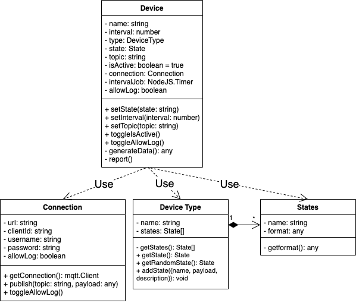

# IoT Device Simulator

**IoT device simulator to auto generate random data in custom format and publish to MQTT broker.**

Feedback, issues and pull requests are always appreciated :)

<!-- [](https://github.com/masonCalmAndCode/iot-device-simulator) -->

[](https://github.com/masonCalmAndCode/iot-device-simulator)
[](https://github.com/masonCalmAndCode/iot-device-simulator)

<!-- [](https://github.com/masonCalmAndCode/iot-device-simulator) -->

<div align="center">
  
</div>

## Installation

Run `npm install iot-device-simulator --save` to download the library.

## Usage

### Import Modules

```typescript
// Approach 1
import simulator from 'iot-device-simulator';
// Approach 2
import {
  createConnectionToBroker,
  createDevice,
  createDeviceType,
} from 'iot-device-simulator';
```

#### **Module Class Schema**



#### **Create Connection**

```typescript
import { createConnectionToBroker } from 'iot-device-simulator';
const connection = createConnectionToBroker({
  url: 'http://your.domain:1883',
  clientId: 'your_clientId',
  username: 'your_name',
  password: 'your_password',
});
```

#### **Create Device Type With States**

A device type has multiple states. Every State has a customized report format.
Random dummy data will be generated following the format of the state.

```typescript
const lum = createDeviceType('luminance_meter');

// Create State With Custimised Report Format
const lumFormat = [
  { id: 'version', value: ['v1', 'v2'] },
  { id: 'voltage', value: { max: 100, min: 0, digit: 0 } },
  { id: 'module', value: 1.1 },
];

// Every state has it's own report format
lum.addState({
  name: 'dark',
  payload: [
    ...lumFormat,
    { id: 'brightness', value: { max: 20, min: 0, digit: 1 } }, // different states may return different lum
  ],
});
lum.addState({
  name: 'dusk',
  payload: [
    ...lumFormat,
    { id: 'brightness', value: { max: 40, min: 20, digit: 1 } },
  ],
});
lum.addState({
  name: 'day',
  payload: [
    ...lumFormat,
    { id: 'brightness', value: { max: 100, min: 40, digit: 1 } },
  ],
});
```

#### **Device Type State Format Settings**

There are 2 category of type 'value' and 'reference'. 'value' type is the base case of the column, and the reference type is combination of the base case. Please see the examples as below.

_ps: If you want to test or simply generate dummy data from the format can use the '**generateDataFromFormat**' function_

##### **1. Value Type column**

- **string**

```typescript
import { generateDataFromFormat } from 'iot-device-simulator';

const result = generateDataFromFormat('A string'); //  A string

console.log(result); // A string
```

- **number**

```typescript
import { generateDataFromFormat } from 'iot-device-simulator';

const result = generateDataFromFormat(123);

console.log(result); // 123
```

##### **2. Reference Type column**

- **range**
  - Pass in an object with max, min and digit, then will generate random number with specified decimals equals to digit

```typescript
const result = generateDataFromFormat({ max: 100, min: 0, digit: 2 });
console.log(result); // number 0~100 with 2 decimals, ex: 29.03
```

- **tuple**
  - combined multiple base columns and reference columns into an array, will generate a tuple with random or fixed value in position

```typescript
const result = generateDataFromFormat([
  8, // number
  { max: 100, min: 0, digit: 0 }, // range
  'voltage', // string
  {
    // object
    id: 'voltage',
    value: { max: 10, min: 0, digit: 0 },
  },
]);
console.log(result); // [ 8, 52, 'voltage', { id: 'voltage', value: 10 } ]
```

- **enum**
  - combined multiple base columns into an array, will return a random element in array

```typescript
const result = generateDataFromFormat([
  0, // number
  'v1.0', // string
  123, // number
]);
console.log(result); // 0 or 'v1.0' or 123
```

- **object**
  - object combination, the keys can be any string, and value can be any base column or reference columns

```typescript
const result = generateDataFromFormat({
  id: 'axisZ', // string
  value: 6.6, // number
  range: { max: 100, min: 0, digit: 0 }, // range
  // or any other types in value even object itself, nested combination is allowed
});
console.log(result); // { id: 'axisZ', value: 6.6, range: 56 }
```

#### **Create Device Instance From Device Type**

```typescript
const lumBot = createDevice({
  type: lum,
  state: 'day',
  connection,
  topic: '$device/IOTAWSOME/report',
});
// change state to change report
lumBot.setState('dusk');
// change interval to change time to send report to broker every interval seconds
lumBot.setInterval(2000);
// change topic to report
lumBot.setTopic('$device/IOTAWSOME/report');
// change state of device, when active constantly send report, when inactive stop to report
lumBot.toggleIsActive();
```

## Test

To start an test, run the following command:

`npm run test`

## License

© Mason Yu (masonCalmAndCode), 2022-NOW

Released under the [MIT License](https://github.com/masonCalmAndCode/iot-device-simulator/blob/main/LICENSE)
