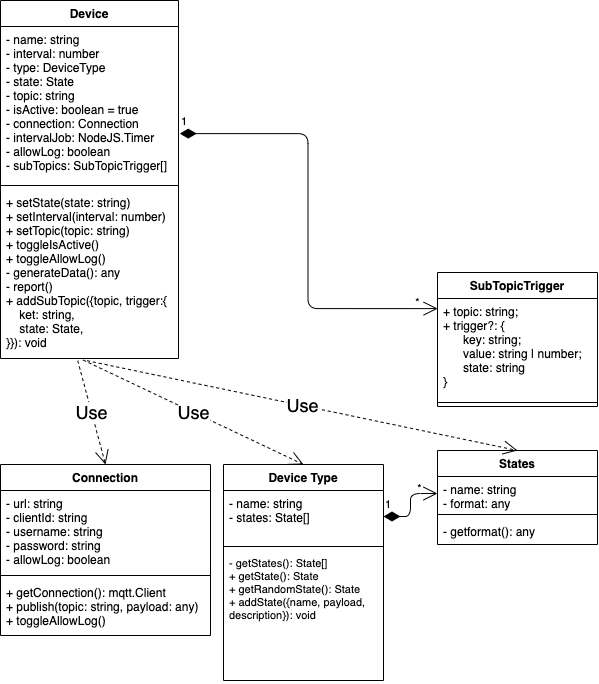

# IoT Device Simulator

**IoT device simulator to auto-generate random data in a custom format and publish to MQTT broker.**

Feedback, issues, and pull requests are always appreciated :)

<!-- [](https://github.com/masonCalmAndCode/iot-device-simulator) -->

[](https://github.com/masonCalmAndCode/iot-device-simulator)
[](https://github.com/masonCalmAndCode/iot-device-simulator)

<!-- [](https://github.com/masonCalmAndCode/iot-device-simulator) -->

<div align="center">
  
</div>

## Installation

Run `npm install iot-device-simulator --save` to download the library.

## Features

- Easily generate dummy data from a customized format
- Publish customized report to MQTT broker in interval time
- Easily change the state of the device simulator to generate different data to represent the different scenario

## **Module Schema**



## Import Modules

```typescript
// Approach 1
import simulator from 'iot-device-simulator';
// Approach 2
import {
  createConnectionToBroker,
  createDevice,
  createDeviceType,
} from 'iot-device-simulator';
```

## Usage

#### 1. **Create Connection**

```typescript
import { createConnectionToBroker } from 'iot-device-simulator';
const connection = createConnectionToBroker({
  url: 'http://your.host.and.port:1234',
  clientId: 'your_clientId',
  username: 'your_name',
  password: 'your_password',
});
```

#### 2. **Create Device Type And States**

A device type has multiple states. Every state has a customized report format.
Dummy data will generate randomly according to the format of the state.

```typescript
const lum = createDeviceType('luminance_meter');

// Create State With Custimised Report Format
const lumFormat = [
  { id: 'version', value: ['v1', 'v2'] },
  { id: 'voltage', value: { max: 100, min: 0, digit: 0 } },
  { id: 'module', value: 1.1 },
];

// Every state has it's own report format
lum.addState({
  name: 'dark',
  payload: [
    ...lumFormat,
    { id: 'brightness', value: { max: 20, min: 0, digit: 1 } }, // different states may return different lum
  ],
});
lum.addState({
  name: 'dusk',
  payload: [
    ...lumFormat,
    { id: 'brightness', value: { max: 40, min: 20, digit: 1 } },
  ],
});
lum.addState({
  name: 'day',
  payload: [
    ...lumFormat,
    { id: 'brightness', value: { max: 100, min: 40, digit: 1 } },
  ],
});
```

##### **Device Type State Format Settings**

There are two categories of type 'value' and 'reference'. 'value' type is the base case of the column, and the reference type is the combination of the base case. Please see the examples below.

_ps: If you want to test or get dummy data simply from the format can use the '**generateDataFromFormat**' function_

**1. Value Type column**

Value type columns are the base case of a column.
If you nested the base case in the reference type column, it will recursively loop into it and generate dummy data until the end.

1. **boolean**

1. **number**

1. **string**

```typescript
import { generateDataFromFormat } from 'iot-device-simulator';
console.log(generateDataFromFormat(true)); // true
console.log(generateDataFromFormat(123)); // 123
console.log(generateDataFromFormat('IoT')); // IoT
```

**2. Reference Type column**

Reference type columns are a combination of base case columns. The function for generating data will recursively loop into and generate dummy data until hit a base case end.

- **range**
  - An object with max, min, and digit
  - Return a random number with specified decimals equal to the digit

```typescript
const result = generateDataFromFormat({ max: 100, min: 0, digit: 2 });
console.log(result); // number 0~100 with 2 decimals, ex: 29.03
```

- **tuple**
  - Combined multiple base columns and reference columns into an array
  - Return element in the array randomly

```typescript
const result = generateDataFromFormat([
  8, // number
  { max: 100, min: 0, digit: 0 }, // range
  'voltage', // string
  {
    // object
    id: 'voltage',
    value: { max: 10, min: 0, digit: 0 },
  },
]);
console.log(result); // [ 8, 52, 'voltage', { id: 'voltage', value: 10 } ]
```

- **enum**
  - Combined multiple base columns into array
  - Return element in the array randomly

```typescript
const result = generateDataFromFormat([
  0, // number
  'v1.0', // string
  123, // number
]);
console.log(result); // 0 or 'v1.0' or 123
```

- **object**
  - object with keys storing a value of value or reference type of columns
  - return an object of recursively generated data

```typescript
const result = generateDataFromFormat({
  id: 'axisZ', // string
  value: 6.6, // number
  range: { max: 100, min: 0, digit: 0 }, // range
  // or any other types in value even object itself, nested combination is allowed
});
console.log(result); // { id: 'axisZ', value: 6.6, range: 56 }
```

#### 3.**Create Device Instance From Device Type**

```typescript
const lumBot = createDevice({
  type: lum,
  state: 'day',
  connection,
  topic: '$device/IOTAWESOME/report',
});
// change state to change report
lumBot.setState('dusk');
// change interval to change time to send report to broker every interval seconds
lumBot.setInterval(2000);
// change topic to report
lumBot.setTopic('$device/IOTAWESOME/report');
// change state of device, when active constantly send report, when inactive stop to report
lumBot.toggleIsActive();
```

#### 4. Subscribe Topic To Trigger State Changing

- examples
  - change the state to 'dark', when get topic `$device/IOTAWESOME/cmd` publish message, and the payload index 0 , 'value' key's value equals to 10

```typescript
lumBot.addSubTopic({
  topic: '$device/IOTAWESOME/cmd', // topic to sbscribe
  trigger: { key: '0.value', value: 10, state: 'dark' },
  // key to get value from key and the expected state
  // key will be split by '.' and for the keys array to get the value. like example below:
  // example payload => [{ id: 'brightness', value: 10 }];
  // payload[0]['value'] = 10
});
```

## Test

To start a test, run the following command:

`npm run test`

## License

© Mason Yu (masonCalmAndCode), 2022-NOW

Released under the [MIT License](https://github.com/masonCalmAndCode/iot-device-simulator/blob/main/LICENSE)
